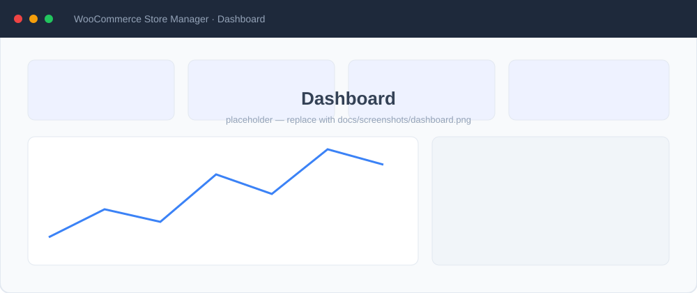
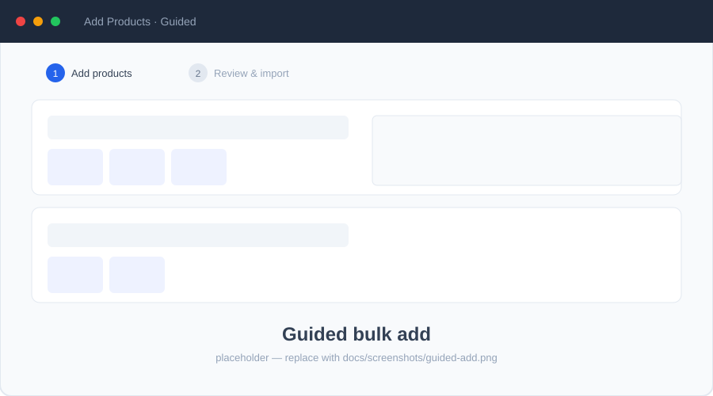
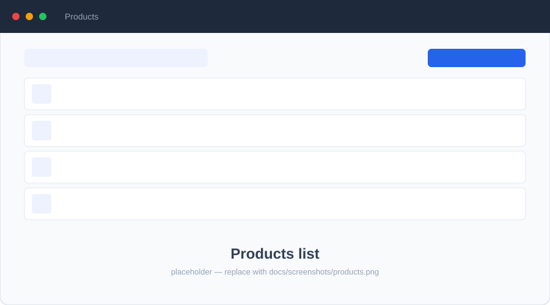
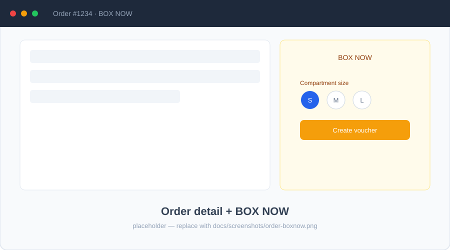
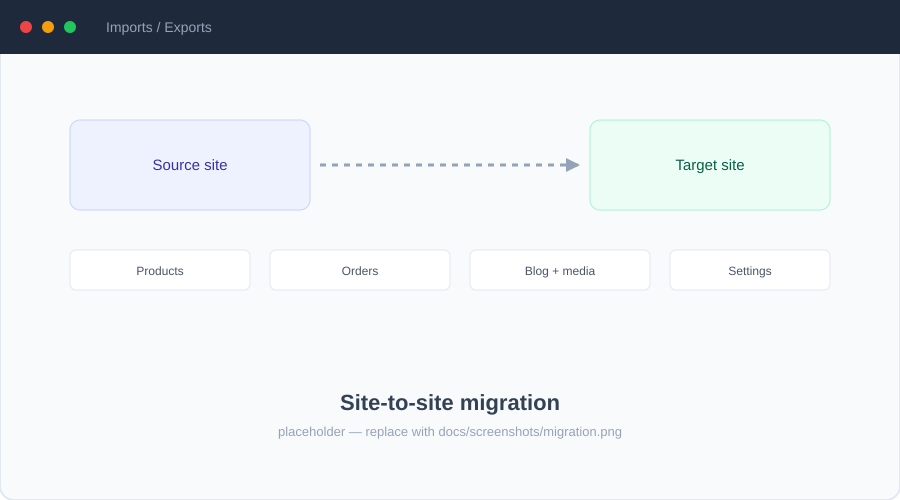

# 🛍️ WooCommerce Store Manager

> A self-hosted admin panel for running one or more WooCommerce stores from a single browser tab — products, orders, coupons, analytics, and full **site-to-site migration**.


A FastAPI backend wraps the WooCommerce REST API, the WordPress Media/Posts APIs, and a couple of niche integrations; a React UI gives you everything you'd normally do across a dozen WP-admin pages. A site selector in the nav bar switches between configured stores — every page re-fetches for the active site.

<p align="center">
  
</p>

<table>
  <tr>
    <td width="50%"></td>
    <td width="50%"></td>
  </tr>
  <tr>
    <td width="50%"></td>
    <td width="50%"></td>
  </tr>
</table>

> 📸 The images above are placeholders. See the [screenshots guide](docs/screenshots/README.md) for the shot-list and how to drop in real captures.

---

## Table of contents

- [Highlights](#highlights)
- [Features](#features)
- [Tech stack](#tech-stack)
- [Getting started](#getting-started)
  - [Environment variables](#environment-variables)
  - [Run](#run)
- [Project structure](#project-structure)
- [API surface](#api-surface)
- [Bulk import format](#bulk-import-format)
- [Notes](#notes)
- [Development](#development)

---

## Highlights

- 🧙 **Guided bulk add** — a visual, step-by-step wizard to create many variable products at once (colors × sizes, per-variation price/stock/images), plus a raw JSON importer.
- 🔁 **Site-to-site migration** — copy products, orders, customers, coupons, taxes, shipping, blog posts, media, and store/email settings between stores, with upsert + URL rewriting.
- 📊 **Analytics dashboard** — revenue/orders/AOV with period comparisons, sales trends, an order heatmap, top sellers/customers, and low-stock/expiring-coupon alerts.
- 📦 **BOX NOW shipping** — create/cancel/track parcel-locker vouchers (pick S/M/L) straight from an order, with a webhook receiver.
- 🖼️ **Image hygiene** — de-duplicated uploads and image audit/relink so WooCommerce stops sideloading copies.
- 🌐 **Multi-site** — one UI, many stores, credentials resolved per site from `.env`.

---

## Features

<details open>
<summary><strong>Products</strong></summary>

- Browse / search / filter by status, type, category, tag, stock
- Per-page selector (20 / 50 / 100 / All) with server-side pagination
- Create variable products with size/color variations, per-variation pricing, stock, and images
- Edit metadata, categories, tags, status, prices; manage main images with a media-library picker + lightbox
- **Guided bulk add** wizard *and* JSON bulk import (upsert: existing products are updated, new ones created — variations and long descriptions preserved on update)
- Row selection with bulk actions: append secret tags to many products, bulk delete
- Image hygiene: **image audit** (flags suspicious numeric/external filenames) and **relink images** (swaps external URLs for local WP media by filename)
</details>

<details>
<summary><strong>Categories, tags &amp; attributes</strong></summary>

- Categories page: list, create, edit, delete
- Taxonomy page: manage global attributes and their terms (e.g. Color, Size) plus tags — full CRUD
- Create a category or tag inline while adding products
</details>

<details>
<summary><strong>Secret tags</strong></summary>

- Hidden internal-only tags stored as a `<span style="display:none">` inside the product description
- Searchable from the WooCommerce admin; invisible to customers
- Editable inline in the table, on the edit page, and via bulk operations
</details>

<details>
<summary><strong>Orders &amp; BOX NOW</strong></summary>

- Order list with status filter, search, inline status changes; date-range filter (dashboard drill-down)
- Order detail: line items, billing, shipping, customer + internal notes
- **BOX NOW** (Greek parcel-locker network): Partner API v7.2 client — OAuth2, create voucher (choose compartment size S/M/L), cancel, track, fetch PDF/ZPL label
- Voucher persisted to WC order meta; order notes on create/cancel/webhook events
- Webhook receiver at `POST /api/orders/boxnow/webhook`
</details>

<details>
<summary><strong>Coupons</strong></summary>

- List, create, edit, delete coupons
- Full modal: discount type, amount, expiry, usage limits, product/category/email restrictions, behavior flags (individual use, free shipping, exclude sale items)
</details>

<details>
<summary><strong>Dashboard</strong></summary>

- KPI cards: total products, stock status, stock value, period revenue / orders / AOV / refunds
- Period selector (week / month / last month / year / all) with period-over-period deltas
- "Needs your attention": orders to ship, expiring coupons, low stock
- Sales trend (daily → monthly buckets), orders-per-month chart with drill-down, day×hour heatmap
- Top sellers, top customers, active coupons, per-category/tag/secret-tag distributions
- Out-of-stock list, recent orders, density toggle, quick actions
</details>

<details>
<summary><strong>Site-to-site migration (Imports / Exports)</strong></summary>

- Copy content between any two configured sites from one screen, with live progress
- **Blog:** posts (+ categories, tags, featured images) — upsert by slug, images re-hosted & rewritten
- **Media:** WP media library, de-duplicated by filename + title (optional overwrite)
- **WooCommerce:** products + variations, coupons, orders, customers, tax classes/rates, shipping, store + email settings
- **Taxonomy sync:** attributes, shipping classes, categories, tags → target before importing products
- Upsert everywhere (SKU / name / slug / email / code) with ID-mapping helpers and resilient fallbacks
</details>

---

## Tech stack

| Layer | Stack |
|-------|-------|
| Backend | Python 3.12 · FastAPI · Pydantic 2 · `woocommerce` SDK |
| Frontend | React 18 + Vite · TanStack Query · React Router · Tailwind CSS · `react-hot-toast` |
| External | WooCommerce REST API v3 · WP Media/Posts API · BOX NOW Partner API v7.2 |

---

## Getting started

**Prerequisites**

- Python 3.12 · Node 18+
- A WooCommerce store with REST API keys (Consumer Key + Secret, read/write on products, orders, coupons, reports) and a WordPress **application password** for media uploads

**Install**

```bash
# backend
python3.12 -m venv .venv
source .venv/bin/activate
pip install -r requirements.txt

# frontend
cd ui && npm install
```

**Configure sites** — sites are declared in `sites.json`, which maps field names to `.env` variable names (credentials never live in the JSON).

<details>
<summary>Add another site</summary>

```json
{
  "id": "my_new_site",
  "label": "my-new-site.example.com",
  "env": {
    "wc_url":      "MY_SITE_URL",
    "wp_user":     "MY_SITE_WP_USER",
    "wp_password": "MY_SITE_WP_PASSWORD",
    "wc_key":      "MY_SITE_CONSUMER_KEY",
    "wc_secret":   "MY_SITE_CONSUMER_SECRET"
  }
}
```

```bash
MY_SITE_URL=https://my-new-site.example.com
MY_SITE_WP_USER=admin
MY_SITE_WP_PASSWORD=xxxx xxxx xxxx xxxx xxxx xxxx
MY_SITE_CONSUMER_KEY=ck_...
MY_SITE_CONSUMER_SECRET=cs_...
```

Restart the backend — the new site appears in the nav selector.
</details>

### Environment variables

Create `.env` in the project root. **The default site** uses the unprefixed names; extra sites use the names you map in `sites.json`.

**WooCommerce + WordPress (per site)**

| Variable | Required | Purpose |
|----------|:--------:|---------|
| `WC_URL` | ✅ | Store base URL, e.g. `https://cranky.gr` |
| `CONSUMER_KEY` | ✅ | WooCommerce REST consumer key (read/write on products, orders, coupons, reports) |
| `CONSUMER_SECRET` | ✅ | WooCommerce REST consumer secret |
| `WP_USER` | ✅ for media | WordPress username (media library / uploads) |
| `WP_PASSWORD` | ✅ for media | WordPress **application password** (Users → Profile → Application Passwords) |
| `WC_QUERY_STRING_AUTH` | ⬜ | `true` to force query-string auth if your host strips the Basic-auth header (default `false`) |

**BOX NOW** — only if you use the parcel-locker integration:

| Variable | Required | Purpose |
|----------|:--------:|---------|
| `BOXNOW_API_URL` | ✅* | API base — `https://api-stage.boxnow.gr` (staging) or the production URL |
| `BOXNOW_CLIENT_ID` | ✅* | OAuth2 client id (Partner API) |
| `BOXNOW_CLIENT_SECRET` | ✅* | OAuth2 client secret |
| `BOXNOW_WAREHOUSE_ID` | ✅* | Origin pickup-point `locationId` |
| `BOXNOW_WAREHOUSE_CONTACT_NAME` / `_EMAIL` / `_PHONE` | ✅* | Origin contact (phone in full international format, `+30…`) |
| `BOXNOW_DEFAULT_COMPARTMENT_SIZE` | ⬜ | Default parcel size `1`=S, `2`=M, `3`=L (default `1`) |
| `BOXNOW_DEFAULT_WEIGHT` | ⬜ | Default weight in grams (default `0`) |
| `BOXNOW_TRACKING_URL_TEMPLATE` | ⬜ | Public tracking URL; `{voucher}` is substituted |
| `BOXNOW_VOUCHER_META_KEY` | ⬜ | Order meta key holding the voucher (default `_boxnow_parcel_ids`) |
| `BOXNOW_LOCKER_META_KEY` | ⬜ | Order meta key holding the chosen locker (default `_boxnow_locker_id`) |

<sub>✅* = required only when the BOX NOW integration is used. BOX NOW settings are global (not per-site).</sub>

<details>
<summary>Example <code>.env</code></summary>

```bash
# ── Site 1: cranky.gr ───────────────────────────────
WC_URL=https://cranky.gr
CONSUMER_KEY=ck_...
CONSUMER_SECRET=cs_...
WP_USER=admin
WP_PASSWORD=xxxx xxxx xxxx xxxx xxxx xxxx

# ── Site 2: cranky.cranky.gr ────────────────────────
CRANKY_CRANKY_URL=https://cranky.cranky.gr
CRANKY_CRANKY_CONSUMER_KEY=ck_...
CRANKY_CRANKY_SECRET=cs_...
CRANKY_CRANKY_WP_USER=admin
CRANKY_CRANKY_WP_PASSWORD=xxxx xxxx xxxx xxxx xxxx xxxx

# ── BOX NOW (optional) ──────────────────────────────
BOXNOW_API_URL=https://api-stage.boxnow.gr
BOXNOW_CLIENT_ID=
BOXNOW_CLIENT_SECRET=
BOXNOW_WAREHOUSE_ID=
BOXNOW_WAREHOUSE_CONTACT_NAME=
BOXNOW_WAREHOUSE_CONTACT_EMAIL=
BOXNOW_WAREHOUSE_CONTACT_PHONE=+30...
BOXNOW_LOCKER_META_KEY=_boxnow_locker_id
BOXNOW_VOUCHER_META_KEY=_boxnow_parcel_ids
BOXNOW_DEFAULT_COMPARTMENT_SIZE=1
BOXNOW_DEFAULT_WEIGHT=0
BOXNOW_TRACKING_URL_TEMPLATE=https://t.boxnow.gr/?track={voucher}
```

> For every extra site in `sites.json`, add the five mapped variables you named there.
</details>

### Run

```bash
# Terminal 1 — backend
source .venv/bin/activate
uvicorn api.main:app --reload            # add --log-level debug for verbose logs

# Terminal 2 — frontend
cd ui && npm run dev
```

Open <http://localhost:5173> (Vite proxies `/api/*` to FastAPI on port 8000). API docs (Swagger) at <http://localhost:8000/docs>.

---

## Project structure

<details>
<summary>Show tree</summary>

```
.
├── sites.json                 # Site registry — maps site IDs to .env key names
├── api/                       # FastAPI backend
│   ├── main.py                # App entrypoint, CORS, router wiring
│   ├── dependencies.py        # Per-site cached adapter instances
│   ├── site_registry.py       # Reads sites.json + .env, resolves credentials
│   ├── routers/
│   │   ├── sites.py           # GET /api/sites — list configured sites
│   │   ├── products.py        # Products + variations + bulk import + secret tags
│   │   ├── orders.py          # Orders + BOX NOW (vouchers, labels, webhook)
│   │   ├── coupons.py         # Coupon CRUD
│   │   ├── media.py           # WP media listing + de-duplicated upload
│   │   ├── dashboard.py       # Aggregated metrics + charts data
│   │   └── blog_migration.py  # Blog / media / WC import-export
│   └── schemas/               # Pydantic request models
│
├── data_sources/              # External-API adapters
│   ├── wc_products_adapter.py # WooCommerce wrapper (woocommerce SDK)
│   ├── wp_image_adapter.py    # WordPress media (basic auth)
│   ├── boxnow_adapter.py      # BOX NOW Partner API client
│   └── data/products_data.py  # Legacy ProductStore (bulk-import shape)
│
├── domains/                   # Domain logic (variable-product + variation build)
├── interactors/               # Orchestration between adapters and domain
├── ui/                        # React app (Vite)
│   └── src/
│       ├── context/           # SiteContext — active-site state + selector
│       ├── pages/             # Route components
│       ├── components/        # GuidedBulkAdd, VariationBuilder, MediaPicker, …
│       └── api/client.js      # axios wrapper — passes ?site= to every call
└── utils/config.py            # .env loader
```
</details>

---

## API surface

<details>
<summary>Show endpoints</summary>

```
Sites
  GET    /api/sites                        list configured sites (from sites.json)

Products
  GET    /api/products                    list + filter + paginate
  POST   /api/products                    create (variable or simple)
  GET    /api/products/{id}
  PUT    /api/products/{id}
  DELETE /api/products/{id}
  POST   /api/products/bulk               upsert from JSON array
  POST   /api/products/{id}/relink-images swap external image URLs → local media IDs
  GET    /api/products/image-audit        flag products with suspicious image filenames
  GET    /api/products/{id}/variations
  POST   /api/products/{id}/variations
  PUT    /api/products/{id}/variations/{var_id}
  DELETE /api/products/{id}/variations/{var_id}
  GET    /api/products/{id}/secret-tags
  POST   /api/products/{id}/secret-tags

Taxonomy (categories / tags / attributes + terms — full CRUD)
  GET POST                  /api/products/categories
  PUT DELETE                /api/products/categories/{id}
  GET POST                  /api/products/tags
  PUT DELETE                /api/products/tags/{id}
  GET POST                  /api/products/attributes
  PUT DELETE                /api/products/attributes/{id}
  GET POST                  /api/products/attributes/{id}/terms
  PUT DELETE                /api/products/attributes/{id}/terms/{term_id}

Coupons
  GET POST                  /api/coupons
  GET PUT DELETE            /api/coupons/{id}

Orders
  GET    /api/orders                       list + filter + paginate (incl. after/before)
  GET    /api/orders/{id}
  PUT    /api/orders/{id}/status
  GET POST                  /api/orders/{id}/notes

BOX NOW
  GET    /api/orders/{id}/boxnow           current voucher + diagnostic meta
  POST   /api/orders/{id}/boxnow           create voucher (?size=1|2|3 → S/M/L)
  DELETE /api/orders/{id}/boxnow           cancel voucher
  GET    /api/orders/{id}/boxnow/track     parcel state + tracking URL
  GET    /api/orders/{id}/boxnow/label     stream PDF/ZPL label
  POST   /api/orders/boxnow/webhook        receive parcel event webhooks

Media
  GET    /api/media                        list all WP media
  POST   /api/media                        upload (multipart, de-duplicated by filename)

Dashboard
  GET    /api/dashboard/overview           catalog status/type/stock counts
  GET    /api/dashboard/top-sellers
  GET    /api/dashboard/by-category | by-tag | by-secret-tag
  GET    /api/dashboard/out-of-stock
  GET    /api/dashboard/inventory/stats    stock value, units, managed-product count
  GET    /api/dashboard/needs-attention    orders to ship, expiring coupons, low stock
  GET    /api/dashboard/orders/overview    period revenue / orders / AOV (+ comparison)
  GET    /api/dashboard/orders/recent | sales-trend | monthly-trend | heatmap | sparkline
  GET    /api/dashboard/customers/top

Migration (Imports / Exports — source & target chosen per request)
  GET    /api/blog/sites
  POST   /api/blog/export | /api/blog/import              WordPress posts (+cats/tags/images)
  POST   /api/media/export | /api/media/import            WP media library
  POST   /api/wc/sync-taxonomy                            attributes/shipping/cats/tags → target
  POST   /api/wc/export | /api/wc/export-variations       products + variations
  POST   /api/wc/sku-map | /api/wc/import-one             product ID maps + upsert one
  POST   /api/wc/export-coupons | /api/wc/import-coupon   (+ /api/wc/coupon-code-map)
  POST   /api/wc/export-orders  | /api/wc/import-order    (+ /api/wc/order-id-map)
  POST   /api/wc/export-customers | /api/wc/import-customer (+ /api/wc/customer-email-map)
  POST   /api/wc/export-taxes    | /api/wc/import-taxes
  POST   /api/wc/export-shipping | /api/wc/import-shipping
  POST   /api/wc/export-store-settings | /api/wc/import-store-settings
  POST   /api/wc/export-email-settings | /api/wc/import-email-settings
```
</details>

---

## Bulk import format

`POST /api/products/bulk` takes a JSON array of `BulkProductItem`:

```json
{
  "product": {
    "product_name": "Organic Cotton T-Shirt",
    "short_description": "...",
    "categories":     [{"id": "t-shirts"}, {"id": "eco"}],
    "tags":           [{"id": "organic"}],
    "main_image_ids": ["tee-front", "tee-back"],
    "colors": ["Black", "White"],
    "sizes":  ["S", "M", "L", "XL", "2XL"],
    "base_price": "18.00",
    "secret_tags": ["internal-keyword"]
  },
  "variations": {
    "variation_image_mapping": {"S-Black": "tee-s-black", "M-Black": "tee-m-black"},
    "price_overrides":         {"2XL-Black": "20.00"},
    "sale_prices":             {"S-White": "12.00"},
    "stock_quantities":        {"S-Black": 25}
  }
}
```

- `categories[].id` / `tags[].id` accept slugs, names, or numeric IDs.
- `main_image_ids` and `variation_image_mapping` accept WP media IDs (numeric) or filenames without extension (string).
- **Upsert:** an existing product with the same `product_name` is updated (categories, tags, images, short description, secret tags); otherwise it's created with variations.

> Prefer clicking? The **Guided** tab on the Add Products page builds this payload for you.

---

## Notes

- **Order revenue:** WooCommerce's legacy `/reports/sales` is unreliable (counts only `completed`). The dashboard sums `/orders` filtered to `status=completed,processing` — configurable via `DEFAULT_PAID_STATUSES` in `api/routers/dashboard.py`.
- **No view/click tracking:** WooCommerce doesn't track product views; the dashboard is sales-based only. Add Google Analytics if you need view data.
- **Secret-tag scan:** counting secret tags across all products fetches every product and parses descriptions — gated behind a button on the dashboard.

---

## Development

- **Tests:** none yet — please add them as you change things.
- **State:** none — every page reads live from WooCommerce; the frontend caches with TanStack Query and a singleton adapter pre-fetches products/categories/tags/media, invalidated after mutations.
- **Python style:** `black` defaults if you adopt it.
